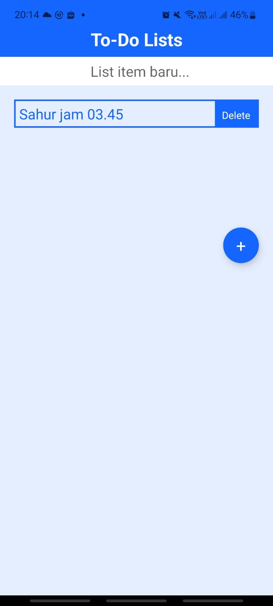

# To-Do List Mobile App



## Deskripsi Aplikasi
Aplikasi yang dapat membantu membantu dalam mencatat aktivitas-aktivitas yang perlu dilakukan.

## Note
Aplikasi dibuat dahulu di dalam Snack kemudian di build melalui Visual Studio Code.

## Cara Instalasi
Jalankan perintah di bawah ini untuk melakukan instalasi npm.

```
npm install
```

Kemudian, jalankan perintah ini untuk membuka aplikasi via expo:
```
npm start


